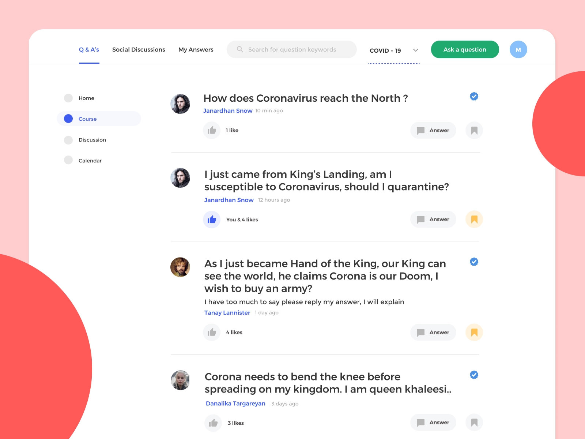

## TEAM MEMBERS

Mahir Rahman - 71811509  
Abdullah Kaf - 47359534

## Project Description

For our team, we have decided to go along with the discussion forum platform for our project. The basic Idea will be to recreate a website emanating a blog forum where users can publish blogs and be able to post written text statements while also broadcasting those statements throughout the platform. We have created the following list of capabilities that our website will host for our finished product:

Basic Page Idea:

    

Credit: [Misba Abbas](https://dribbble.com/shots/11024734-Discussion-Corona)

### MyDiscussionForum Functional Requirements

#### Website functions

1. Responsive web design for mobile view/tablet view/desktop view
2. Security of information through user creation
3. Usage of database to store and sort website data
4. UI/UX design for ease of use, aesthetic appeal, and basic web-design principles for accessibility towards differentiating user characteristics.

#### User Creation/Admin/ UI Functions

1. Ability to share blog text posted by users and share them publicly
2. Non user clients have the ability to view, read, search by keyword for posts but prohibited from creating their own posts (read only permissions for these users, unless individual profile is created)
3. Ability to create password protected user profile
4. Admin can enable/disable user accounts. Users can also report other problematic comments/posts.
5. Storage space allotted to user creation for the ability to post and store blogs
6. Storage space security, only users can edit their own posts, no ability to change foreign user information
7. Notification for each user to represent likes/new comments created on their own post/ ability to turn off notifications.
8. Posts support multimedia (images, etc.)
9. Ability for Admin users to edit/delete/change information for all users and quantitative record of number of users/number of posts/number of interactions(interactions combine likes and comments)
10. User creation with Log-in/Log-out security.
11. Ability to create/edit profile with customization of name, profile picture, contact details (email), user creation details (reset password/set username), and small information block (about me) for user’s to fill out any information to share with their profile (publicly available)
12. User Id/Password recovery through email
13. Differentiating roles for users to segregate admin users and normal users (normal users prevented from any changes towards site management/blog management outside their own profile)
14. The website should have reasonably fast response times
